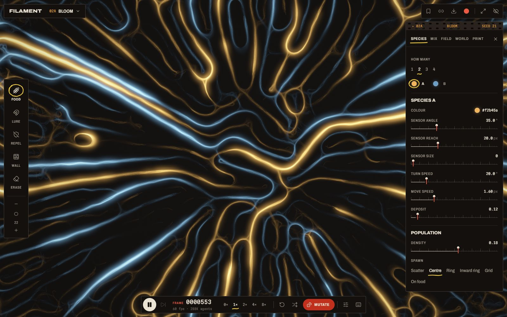
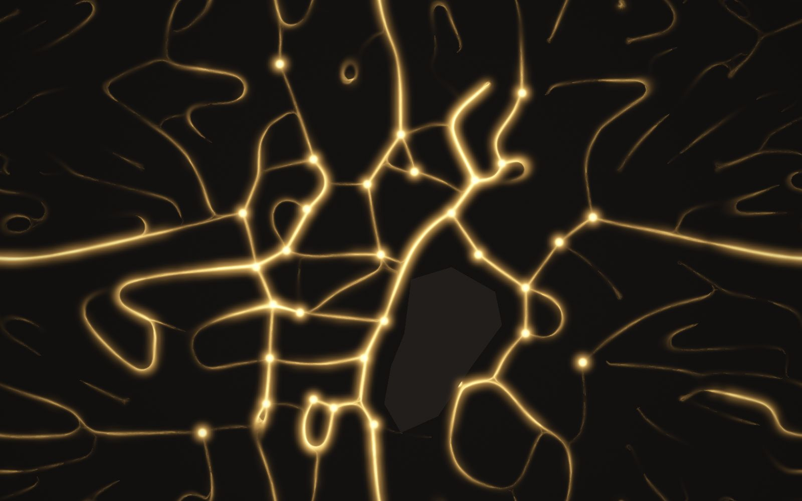

<div align="center">

# Filament

**A slime mould that draws with light.**

Hundreds of thousands of tiny agents follow one simple rule, and living networks grow out of it, live in your browser.

### [Open Filament →](https://vipinsudhakar.github.io/physarum/)

</div>


## What it is

Filament is a toy and a showpiece built on *Physarum polycephalum*, the slime mould famous for growing efficient networks between food sources. Every agent does the same three things: it **senses** the trail ahead, **turns** toward the strongest scent, and **leaves** a trail of its own. The trails blur and fade, the agents keep reading them, and branching, glowing structures emerge that no single agent ever planned.

Everything runs on your graphics card, in real time.

## The darkroom



Open the darkroom and the print is yours to change.

- **Paint into it.** Lay down **food** and it grows toward it and links it up. **Walls** it must route around, **repellent** it refuses to cross, and a **lure** it chases.
- **Mix up to four species.** Each has its own senses and speed. Decide who follows whom: loyal, chasing, swarming, or keeping apart.
- **Shape the field.** Set how long trails last, how fast they spread, what happens at the edges, and how many agents there are.
- **Grow it over something.** Start from scattered food, a word you type, or a map of Tokyo.
- **Mutate** for a random run that's likely to be beautiful, or pick one of eight presets from the contact sheet.



*The Tokyo preset recreates a famous 2010 experiment: oat flakes placed where the cities around Tokyo sit, and a slime mould that grew a network strikingly like the real rail system.*

## Keep, share, record

- **Every run is a link.** The address bar always replays your exact run. Copy it and send it.
- **Save a print** as a PNG, or **record** the canvas to video.
- **Keep** runs you like. They wait for you on the contact sheet.

### Keys

| Key | Does |
|---|---|
| `Space` | Play / pause |
| `.` | Step one frame |
| `1`–`5` | Food, Lure, Repel, Wall, Erase |
| `[` `]` | Smaller / bigger brush |
| `M` | Mutate |
| `N` | New seed |
| `R` | Start over |
| `P` | Save print |
| `H` | Hide the controls |
| `?` | All shortcuts |

## Browser support

Filament needs **WebGPU**: current Chrome, Edge and Safari, and Firefox 141 or newer. On browsers without it you'll see a recording instead.

## Run it locally

```sh
git clone https://github.com/vipinsudhakar/physarum.git
cd physarum
npm install
npm run dev
```

Then open http://localhost:5173. See [docs/DEVELOPMENT.md](docs/DEVELOPMENT.md) for how it's built, the project layout, and the test tools.

## Credits

The agent model follows Jeff Jones, *Characteristics of pattern formation and evolution in approximations of Physarum transport networks* (2010). The Tokyo map is after Tero et al., *Rules for biologically inspired adaptive network design*, Science (2010).

Made by [Vipin Sudhakar](https://github.com/vipinsudhakar). Released under the [MIT License](LICENSE).
