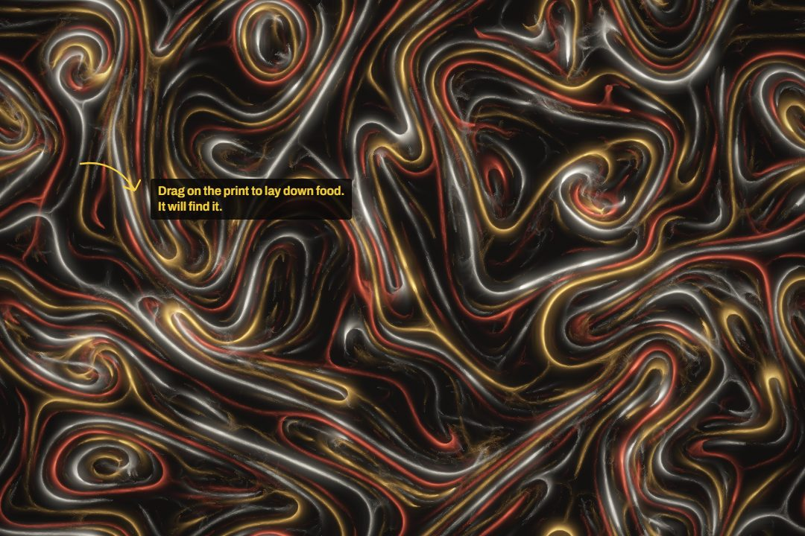

# Filament

A slime mould that draws with light. Millions of agents follow one rule (sense the trail ahead, turn toward the strongest, step, deposit) on a shared field, and glowing networks grow out of it. It runs live in the browser on your GPU through WebGPU, and you can paint into it.



**Live:** https://vipinsudhakar.github.io/physarum/

## What's in it

- **Up to four species**, each with its own sensing and motion, and a 4×4 matrix deciding who follows and who flees whom.
- **A world you can paint**: food it grows toward and links up, walls, repellent, and lures. Or start from scattered food, a word, or a map of Tokyo with the bay walled off (after Tero et al., *Science* 2010).
- **A darkroom studio**: tools, a full inspector, presets on a contact sheet, a Mutate button for a random run that's likely to be beautiful, and keyboard shortcuts (`?`).
- **Share, save, record**: the address bar is always a link that replays the exact run, prints save as PNG, and the canvas records to WebM. Runs can be kept in the browser.
- **Reproducible**: the same params and seed replay bit-for-bit on the same GPU. A seeded PCG hash is shared line-for-line between TypeScript and WGSL, and deposits are fixed-point atomics so GPU scheduling can't change the result.

## Running it

```sh
npm install
npm run dev          # http://localhost:5173
npm run check        # typecheck + lint + unit tests
npm run build
```

It needs a browser with WebGPU (recent Chrome, Edge, Safari 26, Firefox 141+). Browsers without it get a recorded clip instead of a black screen.

### GPU checks

These drive a real browser (Edge by default; set `PW_CHANNEL=chrome` to switch) against the dev server:

| Command | Checks |
|---|---|
| `npm run verify -- tokyo` | the canvas actually develops, sampled over time |
| `npm run determinism` | presets replay bit-for-bit; another seed doesn't |
| `npm run rng-check` | the WGSL and TypeScript random streams agree |
| `npm run fallback` | re-records the no-WebGPU clip and poster |

## How it's built

Vite, TypeScript, React 19, and raw WebGPU/WGSL with no 3D library in between. The engine (`src/engine`) knows nothing about React:

- **agents**: one thread per agent senses, turns, moves, and atomically deposits into its species' channel.
- **diffuse**: blur, decay and food scent over a ping-pong pair of 4-channel trail buffers.
- **brush**: paints into the world layer over just the brush's bounding box.
- **render**: an HDR scene, a half-resolution bloom, then an exponential tone map, vignette and dither.

Uniform structs are generated from one TypeScript definition (`src/engine/layout.ts`), so the WGSL and the packer can't drift apart. UI state lives in Zustand, and controls are Radix primitives. Landing-page motion is GSAP and Lenis, driven by the app's single frame loop.

## Credits

The agent model follows Jeff Jones, *Characteristics of pattern formation and evolution in approximations of Physarum transport networks* (2010). The Tokyo map is after Tero et al., *Rules for biologically inspired adaptive network design* (2010).

MIT licensed. By [Vipin Sudhakar](https://github.com/vipinsudhakar).
